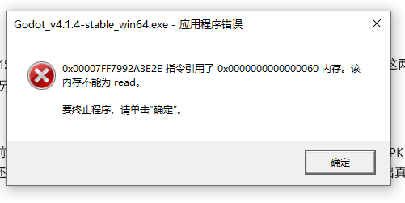

# AGENTS.md

本文件为自动化代理在本仓库中工作的约定。适用范围为仓库根目录及其所有子目录；如果更深层目录以后新增自己的 `AGENTS.md`，以更深层文件为准。

## 项目概况

- 这是一个 Godot 4.1 项目，游戏名来自 `project.godot`：`造梦八荒`。
- 主场景为 `res://Scene/Main_menu/Main_Menu.tscn`。
- 项目视口基准为 `940x590`，拉伸模式为 `canvas_items` / `expand`。
- 代码主要是 GDScript，脚本目录为 `Script/`，场景目录为 `Scene/`，美术与音频资源分散在 `Art/`、`Font/`、`Music/`、`Shader/` 等目录。
- 项目包含大量中文资源名、节点名、输入动作名和物理层名。不要为“规范化”而重命名它们。
- 仓库内有本地 Godot 4.1.4 控制台程序：`.tools/godot-4.1.4/Godot_v4.1.4-stable_win64_console.exe`。

## 重要入口

- `project.godot`：项目配置、autoload、输入动作、物理层、主场景。
- `Global.gd`：全局状态和大量预加载资源。
- `AllEquipment.gd`：大型装备数据表，体积很大，修改时保持最小 diff。
- `PoolManager.gd`：对象池，池化对象应优先走 `get_instance()` / `recycle_instance()`。
- `Script/Base/`：角色、怪物、关卡、buff、弹幕等基础类。
- `Script/MemoryClass/`：存档和设置数据。
- `Script/MobileControls/` 与 `Scene/MobileControls/`：移动端控制。
- `tests/`：PowerShell 与 GDScript 测试/检查脚本。

## 开发命令

在 PowerShell 中从仓库根目录执行：

```powershell
# 查看当前工作区状态
git status --short

# 搜索 GDScript 中的常见待处理标记
rg -n "TODO|FIXME|push_error|assert" -g "*.gd"

# 打开 Godot 编辑器
.\.tools\godot-4.1.4\Godot_v4.1.4-stable_win64_console.exe --path . --editor

# 运行项目
.\.tools\godot-4.1.4\Godot_v4.1.4-stable_win64_console.exe --path .
```

常用检查脚本：

```powershell
powershell -ExecutionPolicy Bypass -File .\tests\screen_fit_math_test.ps1
powershell -ExecutionPolicy Bypass -File .\tests\mobile_controls_test.ps1
powershell -ExecutionPolicy Bypass -File .\tests\game_settings_mobile_controls_test.ps1
powershell -ExecutionPolicy Bypass -File .\tests\android_runtime_project_settings_test.ps1
powershell -ExecutionPolicy Bypass -File .\tests\apk_mobile_minimal_runtime_test.ps1
```

仅在变更涉及对应功能时运行相关测试。不要为了简单文档变更启动 Godot 或执行导出流程。

## 编码与格式

- GDScript 使用 tab 缩进；编辑现有文件时保持原文件风格。
- 新增 `.gd` 文件优先使用 UTF-8 无 BOM。
- 不要对 `.gd`、`.tscn`、`.tres`、`.import` 或大型数据表做全文件格式化。
- 尽量保持现有大小写、拼写、中文/英文混用方式。仓库里存在历史命名和反编译痕迹，随意“修正”会破坏引用。
- 修改 `.tscn`、`.tres`、`project.godot`、导入设置时，优先使用 Godot 编辑器；手工编辑必须非常小心并说明原因。

## 资源与场景规则

- 使用 `res://...` 资源路径，不要改成绝对路径或系统路径。
- 不要删除 `.import` 文件，除非对应源资源也被明确删除。
- 不要手动编辑 `godot/imported/`、`godot/shader_cache/`、`godot/editor/` 等 Godot 生成缓存。
- `.tools/` 是本地工具目录，通常不要修改、清理或提交其中内容。
- 不要重命名节点、资源、输入动作、autoload 名称或物理层名称，除非任务明确要求并且所有引用都已更新。
- 新增脚本放到对应的 `Script/<功能>/` 目录；新增场景放到对应的 `Scene/<功能>/` 目录。

## 代码约定

- 修改 shared/autoload/base 层前先搜索调用点，尤其是：
  - `Script/Base/`
  - `Global.gd`
  - `AllEquipment.gd`
  - `Script/MemoryClass/`
  - `Signals.gd`
  - `PoolManager.gd`
- 池化场景优先使用 `PoolManager.get_instance(path)` 和 `PoolManager.recycle_instance(path, node)`，不要随意改为直接 `instantiate()` / `queue_free()`。
- 如果池化节点需要复用状态，优先实现或维护 `reset_for_pool()`。
- 移动端输入映射依赖 `project.godot` 中的输入动作名，改动前必须确认 `Scene/MobileControls/MobileControls.tscn` 和 `Script/MobileControls/` 的映射。
- 存档逻辑涉及加密文件和设备 ID，修改 `Script/MemoryClass/` 前要确认旧存档兼容性。

## Git 与工作区安全

- 开始修改前查看 `git status --short`。
- 本仓库可能已有大量由用户、Godot 编辑器或导入流程产生的未提交改动。不要还原、覆盖或清理与当前任务无关的文件。
- 禁止使用 `git reset --hard`、批量删除、批量移动或大范围格式化，除非用户明确要求。
- 提交前只暂存本次任务相关文件。
- 汇报时说明实际运行过的验证命令；没有运行的不要声称已通过。

## 何时验证

- 文档或说明文件变更：通常只需检查文件存在、内容合理，以及 `git status --short`。
- GDScript 逻辑变更：至少运行相关 PowerShell 检查脚本，必要时运行 Godot headless/项目启动检查。
- 移动端控制、屏幕适配或 Android 设置变更：运行 `tests/` 中对应的移动端/Android 检查脚本。
- 资源、场景或导入设置变更：优先通过 Godot 编辑器或 Godot 控制台验证，并注意不要提交生成缓存。

## 重要
- 在codex操作时 不要运行类似的操作；会弹框报错；卡住程序 
- 不运行 Godot exe